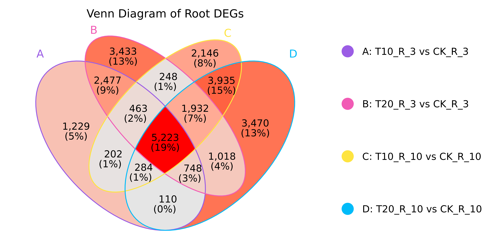

# DrawVennWithLegend Function

A function to create Venn diagrams with customizable legends using ggVennDiagram and patchwork.

## Dependencies

The function requires the following R packages:
- `ggVennDiagram`
- `ggplot2`
- `patchwork`
- `dplyr`

## Function Definition

```r
# The DrawVennWithLegend function should be defined in DrawVennWithLegend.r
# Source the file before using the function:
# source("DrawVennWithLegend.r")
```

## Usage

### Prepare your data

Your input should be a named list where each element contains character vectors of identifiers (e.g., gene names):

```r
# Example data preparation
set.seed(123)
deg_R_1 <- sample(paste0("Gene", 1:1000), 300)
deg_R_2 <- sample(paste0("Gene", 1:1000), 400)
deg_R_3 <- sample(paste0("Gene", 1:1000), 200)
deg_R_4 <- sample(paste0("Gene", 1:1000), 500)

# Create your input list (must be named)
x_input <- list(
  "T10_R_3 vs CK_R_3" = deg_R_1,
  "T20_R_3 vs CK_R_3" = deg_R_2,
  "T10_R_10 vs CK_R_10" = deg_R_3,
  "T20_R_10 vs CK_R_10" = deg_R_4
)
```

### Basic usage with default parameters

```r
# Using default parameters
my_plot <- DrawVennWithLegend(x_input)
print(my_plot)
```

### Advanced usage with custom parameters

```r
# Custom parameters
my_plot_custom <- DrawVennWithLegend(
  x_input,
  title = "My Custom Venn Plot",
  set_colors = c("red", "blue", "green", "orange"), # Change colors
  legend_order = c("A", "B", "C", "D"), # Change legend order (A at top)
  layout_widths = c(2, 1) # Change layout
)
print(my_plot_custom)
```


## Saving the plot

Use `ggsave` to save the generated plot:

```r
ggsave("My_Venn_Plot.png", my_plot, width = 10, height = 6, dpi = 300)
```