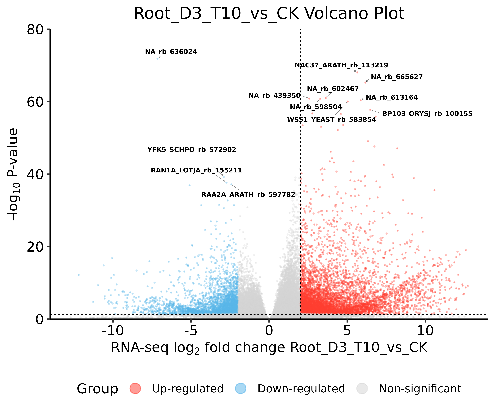

# Highly Customizable Volcano Plot R Function

A volcano plot is a type of scatter plot used in RNA-seq and other omics analyses to visualize the relationship between the magnitude of change (log2 fold change) and statistical significance (adjusted p-value) of gene expression differences. Points on the plot represent genes, with significant up-regulated genes appearing in the upper right, and significant down-regulated genes in the upper left.

This is an R function `DrawVolcano_optimized` based on `ggplot2` and `ggrepel` for quickly drawing publication-ready volcano plots for RNA-seq differential expression analysis.

## Example Plot



## Features

* **Uses `padj`**: Uses adjusted p-values (`padj`) for determining significance and for the Y-axis, adhering to publication standards.
* **Highly Customizable**: Easily adjust point **size**, **alpha**, and **colors** via function parameters.
* **Automatic Labeling**: Uses `ggrepel` to automatically label the Top N up- and down-regulated genes, with customizable label **count**, **size**, and **repulsion force**.
* **Dynamic Axes**: Automatically calculates appropriate symmetrical X-axis and Y-axis ranges.
* **Publication-Ready Theme**: Uses `ggpubr` theme and includes a clean legend.

## Dependencies

Before running this function, please ensure you have installed and loaded the following R packages:

```R
# install.packages(c("ggplot2", "ggrepel", "ggpubr", "dplyr"))
library(ggplot2)
library(ggrepel)
library(ggpubr)
library(dplyr)
```

## Data Format Requirements

The input `deg_result` data.frame must contain the following columns:

* **Symbol**: Gene identifier (character) - this can be gene symbols or other identifiers
* **log2FoldChange**: Log2 fold change (numeric)
* **pvalue**: Raw p-value (numeric, for handling 0s)
* **padj**: Adjusted p-value (numeric, used for plotting and determining significance)

**How to create from DESeq2 results:**
```R
# Assuming 'res' is your DESeq2 results() object
my_deg_result <- res %>%
  as.data.frame() %>%
  tibble::rownames_to_column(var = "Symbol") # Critical step to add gene names

# You can then pass 'my_deg_result' to the function
```
## Usage Examples
1. Prepare Example Data
```R
# (Load dependencies)
library(ggplot2)
library(ggrepel)
library(ggpubr)
library(dplyr)

# (Copy and run the DrawVolcano_optimized function code from above)

# Create a mock DESeq2 result dataframe
set.seed(123)
example_deg_data <- data.frame(
  Symbol = paste0("Gene-", 1:1000),
  log2FoldChange = rnorm(1000, 0, 1.5),
  pvalue = runif(1000, 0, 1),
  padj = runif(1000, 0, 1)
)

# Simulate some significant genes
example_deg_data$log2FoldChange[1:30] <- rnorm(30, 4, 1) # Up-regulated
example_deg_data$padj[1:30] <- runif(30, 0, 0.01)
example_deg_data$pvalue[1:30] <- runif(30, 0, 0.01)

example_deg_data$log2FoldChange[31:60] <- rnorm(30, -4, 1) # Down-regulated
example_deg_data$padj[31:60] <- runif(30, 0, 0.01)
example_deg_data$pvalue[31:60] <- runif(30, 0, 0.01)

# View the data
head(example_deg_data)
```
2. Plot with Default Parameters
```R
# Use default parameters
p1 <- DrawVolcano_optimized(
  deg_result = example_deg_data,          # Input data frame with gene expression results
  pvalCutoff = 0.05,                      # Adjusted p-value threshold for significance
  LFCCutoff = 1.0,                        # Log2 fold change threshold for significance
  EXP_NAEE = "My First Volcano",          # Experiment name for title and labels
  point_size = 1.0                        # Using larger points for the small example dataset
)

print(p1)

# Save the plot
# ggsave("volcano_default.png", p1, width = 7, height = 7, dpi = 300)
```
3. Plot with Custom Parameters
```R
# Custom parameters:
# - Label only Top 5 genes
# - Larger label font size (3)
# - Larger points (2.0) with more alpha (0.5)
# - Set LFC cutoff to 2
p2 <- DrawVolcano_optimized(
  deg_result = example_deg_data,          # Input data frame with gene expression results
  pvalCutoff = 0.05,                      # Adjusted p-value threshold for significance
  LFCCutoff = 2.0,                        # Log2 fold change threshold for significance
  EXP_NAEE = "My Custom Volcano",         # Experiment name for title and labels
  
  label_n_top = 5,                        # Number of top up/down regulated genes to label
  label_size = 3.0,                       # Font size for gene labels
  point_size = 2.0,                       # Size of data points
  point_alpha = 0.5                       # Transparency of data points
)

print(p2)
# ggsave("volcano_custom.png", p2, width = 7, height = 7, dpi = 300)
```
