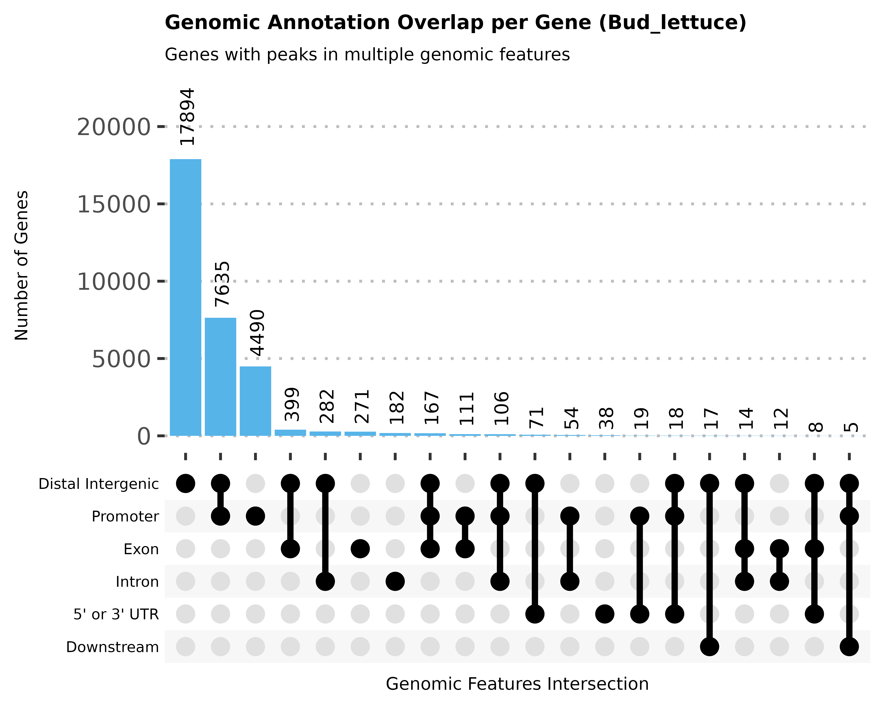

## 📊 ATAC-seq Genomic Annotation UpSet Plotter
这是一个用于 ATAC-seq 数据分析的 R 工具函数。它专门用于处理 ChIPseeker 的注释结果，将其转化为可视化的 UpSet 图，以展示基因在不同基因组区域（Promoter, Enhancer, Exon 等）的重叠调控情况。

### ✨ 功能特点
- 自动数据清洗：自动将复杂的 ChIPseeker 注释（如 Promoter (<=1kb), Promoter (1-2kb)）归类简化为主要类别。
- 智能 Y 轴缩放：根据数据量自动计算 Y 轴高度，防止柱状图溢出或留白过多。
- 可视化增强：结合 ggupset 和 ggpubr 主题，生成出版级（Publication-ready）图表。
- 自动保存：一键生成高分辨率的 .png 和 .pdf 文件 (1000 DPI)。

## 🛠️ 依赖包 (Requirements)
在使用此脚本前，请确保你的 R 环境中安装了以下包
```r
install.packages(c("tidyverse", "ggupset", "ggpubr"))
```
## 📋 输入数据格式 (Input Format)
函数接收一个标准的 Dataframe。根据你提供的示例，数据通常是一个标准的 CSV 文件 (Comma Separated Values)。
关键列 (Required Columns): 虽然输入文件包含很多列（如 seqnames, start, distanceToTSS 等），但在绘图中起关键作用的必须包含以下两列：
- geneId: 基因的唯一标识符 (例如: LOC128129507)。
- annotation: 基因组注释详细信息 (例如: Distal Intergenic, Promoter (<=1kb) 等)。
数据预览 (Example Data):
```txt
"seqnames","start","end","width","strand","annotation","geneChr",...,"geneId",...
"Lsat_v11_chr0",1912390,1912742,353,"*","Distal Intergenic",1,...,"LOC128129507",...
"Lsat_v11_chr0",3009832,3010248,417,"*","Promoter (<=1kb)",1,...,"LOC122195286",...
"Lsat_v11_chr0",3010748,3011033,286,"*","Promoter (<=1kb)",1,...,"TRNAY-GUA_26",...
```
## 🚀 快速开始 (Quick Start)
假设你的脚本保存为 plot_utils.R，数据文件名为 Bud_lettuce_annotation.csv。
```r
library(tidyverse)

# 1. 加载绘图函数
source("plot_utils.R")

# 2. 读取数据 (假设是 CSV 格式)
# 注意：根据你的数据格式，这是一个带表头的 CSV
atac_data <- read_csv("Bud_lettuce_annotation.csv")

# 3. 运行绘图
p <- draw_atac_upset(
  data = atac_data, 
  sample_name = "Bud_lettuce",  # 样本名称，将作为标题和文件名前缀
  save_dir = "./Results"        # 结果保存目录
)

# 4. 在 RStudio 中查看结果
print(p)
```
### 参数说明
| 参数名 | 类型 | 默认值 | 说明 |
| :--- | :--- | :--- | :--- |
| `data` | Dataframe | - | **[必填]** 输入数据框，需含 `geneId` 和 `annotation`。 |
| `sample_name` | String | `"atac_upset"` | **[必填]** 样本名称，用于生成标题和文件名。 |
| `save_dir` | String | `"."` | 图片输出路径，不存在会自动创建。 |
| `fill_color` | String | `"#56B4E9"` | 柱状图填充颜色 (Hex 或颜色名)。 |
| `upset_top_n` | Integer | `20` | X 轴仅显示前 N 个最频繁的交集组合。 |
| `upset_order_by` | String | `"freq"` | 排序方式 (`"freq"` 按数量, `"degree"` 按复杂度)。 |
| `bar_text_size` | Numeric | `2.7` | 柱顶数字标签的大小 (mm)。 |
| `img_width` | Numeric | `5` | 输出图片的宽度 (inch)。 |
| `img_height` | Numeric | `4` | 输出图片的高度 (inch)。 |

### 📂 输出结果 (Output)
函数运行后，会在 save_dir 目录下生成以下文件：
[sample_name]_atac_ann.png (1000 DPI, 高清位图)
[sample_name]_atac_ann.pdf (矢量图, 适合编辑)

